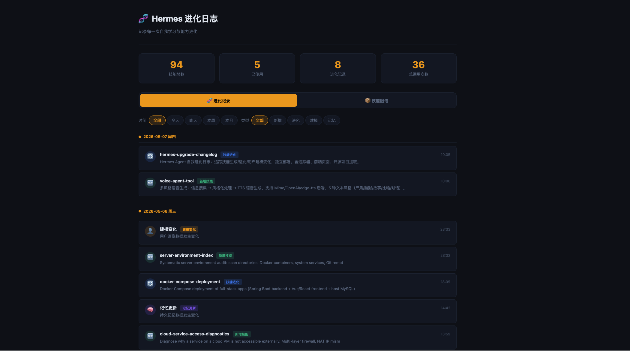
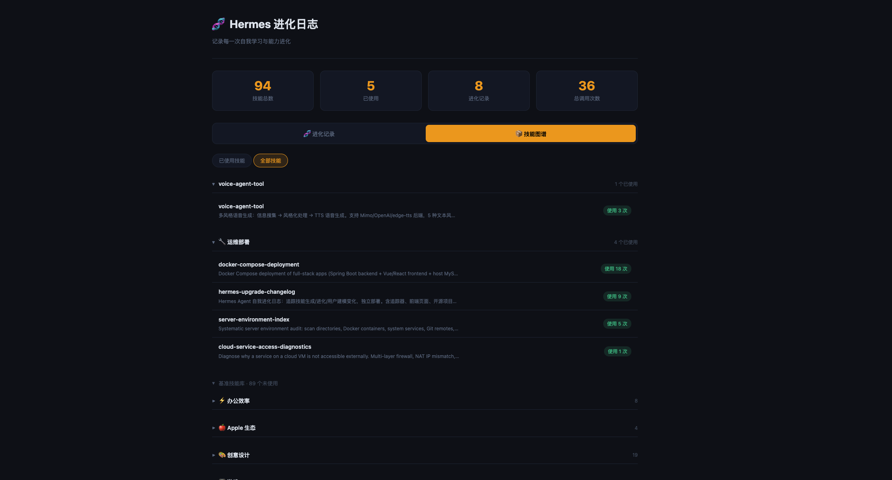

<div align="center">

# 🧬 Hermes Evolution Log

**Hermes Agent 自我进化追踪仪表盘**

*实时监控你的 AI Agent 如何学习、成长和进化*

[](https://opensource.org/licenses/MIT)
[](https://www.python.org/)
[](https://www.docker.com/)
[](https://developer.mozilla.org/)

---



*暗色主题 · 时间线视图 · 技能分类浏览*

</div>

---

## 📖 项目简介

Hermes Evolution Log 是一个独立的 Web 仪表盘工具，专为 [Hermes Agent](https://github.com/NousResearch/hermes-agent) 用户设计。它帮助你可视化地追踪和记录 Agent 的自我进化过程——包括技能的创建与迭代、用户建模的变化、以及长期记忆的更新。

每次 Agent 在你的指导下学习新技能、优化现有能力、或调整对你的理解时，这个仪表盘都会忠实记录下每一个里程碑。

### ✨ 核心特性

| 特性 | 说明 |
|------|------|
| 🌙 **暗色主题 UI** | 现代化的深色界面，长时间使用不伤眼 |
| 📅 **进化时间线** | 按时间顺序展示所有进化事件，一目了然 |
| 📚 **技能图书馆** | 按分类浏览所有技能，区分已使用与未使用 |
| ⏰ **时间过滤** | 灵活的时间范围筛选，快速定位历史事件 |
| 🔄 **变更检测** | 自动检测技能内容变化、新增技能、记忆更新 |
| 🐳 **Docker 一键部署** | 开箱即用，无需繁琐配置 |
| 📊 **统计概览** | 技能总数、使用率、分类分布等关键指标 |

---

## 🏗️ 架构设计

```
┌─────────────────────────────────────────────────────────┐
│                    Docker / 手动部署                       │
├─────────────────────────────────────────────────────────┤
│                                                         │
│  ┌──────────────┐     ┌──────────────┐     ┌────────┐  │
│  │   tracker.py │────▶│  evolution   │────▶│ Nginx  │  │
│  │   (Python)   │     │   .json      │     │  静态   │  │
│  │              │     │  (数据文件)   │     │  服务   │  │
│  └──────┬───────┘     └──────────────┘     └───┬────┘  │
│         │                                       │       │
│         │  扫描                                  │       │
│         ▼                                       ▼       │
│  ┌──────────────┐                      ┌────────────┐  │
│  │  ~/.hermes/  │                      │  Browser   │  │
│  │   skills/    │                      │  前端页面   │  │
│  │   memories/  │                      │  (暗色主题) │  │
│  └──────────────┘                      └────────────┘  │
│                                                         │
└─────────────────────────────────────────────────────────┘
```

**工作流程：**

1. `tracker.py` 扫描 `~/.hermes/skills/` 目录下的所有技能
2. 通过 MD5 哈希对比检测技能变化
3. 监控 `USER.md`（用户建模）和 `MEMORY.md`（长期记忆）的变更
4. 将变化事件追加写入 `data/evolution.json`
5. 前端通过 Nginx 提供静态服务，读取 JSON 渲染仪表盘

---

## 🚀 快速开始

### 方式一：Docker 部署（推荐）

```bash
git clone https://github.com/yourname/hermes-evolution-log.git
cd hermes-evolution-log

# 一键启动
docker-compose up -d

# 访问仪表盘
open http://localhost:9912
```

### 方式二：手动部署

#### 1. 安装依赖

```bash
# Python 依赖
pip install pyyaml

# 前端无需额外依赖，纯静态文件
```

#### 2. 初始化

```bash
# 创建输出目录并生成初始快照
python3 src/tracker.py --install

# 首次运行（建立基线）
python3 src/tracker.py
```

#### 3. 定时执行（可选）

```bash
# 每 30 分钟自动扫描一次
# crontab -e
*/30 * * * * cd /path/to/hermes-evolution-log && python3 src/tracker.py
```

#### 4. 启动 Web 服务

```bash
# 使用 Python 内置服务器
cd frontend
python3 -m http.server 9912

# 或使用 Nginx（推荐生产环境）
```

访问 `http://localhost:9912` 即可看到仪表盘。

---

## ⚙️ 配置

### 环境变量

| 变量 | 默认值 | 说明 |
|------|--------|------|
| `HERMES_DIR` | `~/.hermes` | Hermes Agent 主目录 |
| `EVO_OUTPUT_DIR` | `./data` | 数据输出目录 |

### 命令行参数

```bash
# 指定自定义路径
python3 src/tracker.py --hermes-dir /opt/hermes --output ./my-data

# 查看帮助
python3 src/tracker.py --help
```

### 技能分类映射

Tracker 内置了中文分类映射，自动将英文目录名转换为中文标签：

```
apple           → 🍎 Apple 生态
autonomous-ai-agents → 🤖 Agent 管理
creative        → 🎨 创意设计
data-science    → 📊 数据科学
devops          → 🔧 运维部署
github          → 🐙 GitHub 协作
mlops           → 🧠 AI / 机器学习
productivity    → ⚡ 办公效率
software-development → 💻 开发工具
```

如需自定义分类，修改 `src/tracker.py` 中的 `CATEGORY_CN` 字典即可。

---

## 📁 项目结构

```
hermes-evolution-log/
├── README.md                  # 项目说明（本文件）
├── LICENSE                    # MIT 开源协议
├── docker-compose.yml         # Docker 编排文件
├── Dockerfile                 # Docker 镜像构建文件
├── nginx.conf                 # Nginx 配置
├── src/
│   └── tracker.py             # 核心追踪脚本
├── frontend/                  # 前端静态文件
│   ├── index.html             # 仪表盘主页
│   ├── css/
│   │   └── style.css          # 暗色主题样式
│   └── js/
│       └── app.js             # 前端交互逻辑
├── data/                      # 运行时数据（git ignore）
│   ├── evolution.json         # 进化事件记录
│   └── snapshots/
│       └── state.json         # 上一次扫描快照
└── docs/                      # 文档与截图
    └── screenshot.png         # 界面截图
```

---

## 📊 数据格式

### evolution.json 示例

```json
{
  "events": [
    {
      "type": "skill_created",
      "category": "💻 开发工具",
      "timestamp": "2026-05-05T18:00:00+08:00",
      "data": {
        "skill_name": "web-scraper",
        "description": "自动抓取网页内容并提取结构化数据"
      }
    },
    {
      "type": "skill_evolved",
      "category": "🧠 AI / 推理部署",
      "timestamp": "2026-05-05T18:30:00+08:00",
      "data": {
        "skill_name": "reasoning-engine",
        "description": "增强型多步推理能力"
      }
    },
    {
      "type": "user_modeling",
      "category": "用户建模",
      "timestamp": "2026-05-05T19:00:00+08:00",
      "data": {
        "description": "用户画像数据发生变化"
      }
    },
    {
      "type": "memory_changed",
      "category": "长期记忆",
      "timestamp": "2026-05-05T19:15:00+08:00",
      "data": {
        "description": "持久记忆数据发生变化"
      }
    }
  ],
  "skills_summary": {
    "used": {
      "💻 开发工具": [
        {
          "name": "web-scraper",
          "description": "自动抓取网页内容并提取结构化数据",
          "usage_count": 12,
          "category": "💻 开发工具"
        }
      ]
    },
    "unused": { }
  },
  "stats": {
    "total_skills": 48,
    "used_skills": 15,
    "unused_skills": 33,
    "total_categories": 12,
    "total_usage": 156,
    "last_scan": "2026-05-05T18:00:00+08:00"
  }
}
```

### 事件类型说明

| 事件类型 | 说明 |
|----------|------|
| `skill_created` | Agent 新创建了一个技能 |
| `skill_evolved` | 现有技能的内容发生了变化（被优化/迭代） |
| `user_modeling` | 用户画像数据（USER.md）发生了变化 |
| `memory_changed` | 长期记忆数据（MEMORY.md）发生了变化 |

---

## 🖥️ 截图预览

### 进化时间线


### 技能图书馆



### 统计概览


> 💡 截图将在首次发布时更新。欢迎安装后自行截图并提交 PR！

---

## 🛠️ 技术栈

| 层级 | 技术 | 说明 |
|------|------|------|
| **前端** | HTML5 / CSS3 / Vanilla JS | 纯静态页面，零依赖，暗色主题 |
| **后端** | Python 3.8+ | 轻量级追踪脚本 |
| **数据** | JSON | 无数据库依赖，简单直接 |
| **部署** | Docker + Nginx | 容器化一键部署 |
| **依赖** | PyYAML | 唯一 Python 依赖 |

---

## 🤝 参与贡献

欢迎所有形式的贡献！无论是提交 Bug 报告、功能建议，还是直接提交代码。

### 如何贡献

1. **Fork** 本仓库
2. 创建你的特性分支：`git checkout -b feature/amazing-feature`
3. 提交你的修改：`git commit -m 'feat: 添加某个超酷功能'`
4. 推送到分支：`git push origin feature/amazing-feature`
5. 提交一个 **Pull Request**

### 开发建议

```bash
# 本地开发
git clone https://github.com/yourname/hermes-evolution-log.git
cd hermes-evolution-log

# 运行 tracker
python3 src/tracker.py --install
python3 src/tracker.py

# 启动前端开发服务器
cd frontend && python3 -m http.server 9912
```

### 提交规范

请遵循 [Conventional Commits](https://www.conventionalcommits.org/) 规范：

- `feat:` 新功能
- `fix:` Bug 修复
- `docs:` 文档更新
- `style:` 代码格式调整（不影响功能）
- `refactor:` 代码重构
- `test:` 添加测试
- `chore:` 构建/工具链调整

---

## 📜 更新日志

### v1.0.0 (2026-05-05)

- ✅ 首次发布
- ✅ 技能创建与变更检测
- ✅ 用户建模变化监控
- ✅ 长期记忆变化追踪
- ✅ 暗色主题 Web 仪表盘
- ✅ 技能分类与使用统计
- ✅ Docker 一键部署
- ✅ 时间线视图

---

## 📄 开源协议

本项目采用 [MIT License](LICENSE) 开源协议。

```
MIT License

Copyright (c) 2026 Hermes Evolution Log Contributors

Permission is hereby granted, free of charge, to any person obtaining a copy
of this software and associated documentation files (the "Software"), to deal
in the Software without restriction, including without limitation the rights
to use, copy, modify, merge, publish, distribute, sublicense, and/or sell
copies of the Software, and to permit persons to whom the Software is
furnished to do so, subject to the following conditions:

The above copyright notice and this permission notice shall be included in all
copies or substantial portions of the Software.

THE SOFTWARE IS PROVIDED "AS IS", WITHOUT WARRANTY OF ANY KIND, EXPRESS OR
IMPLIED, INCLUDING BUT NOT LIMITED TO THE WARRANTIES OF MERCHANTABILITY,
FITNESS FOR A PARTICULAR PURPOSE AND NONINFRINGEMENT. IN NO EVENT SHALL THE
AUTHORS OR COPYRIGHT HOLDERS BE LIABLE FOR ANY CLAIM, DAMAGES OR OTHER
LIABILITY, WHETHER IN AN ACTION OF CONTRACT, TORT OR OTHERWISE, ARISING FROM,
OUT OF OR IN CONNECTION WITH THE SOFTWARE OR THE USE OR OTHER DEALINGS IN THE
SOFTWARE.
```

---

<div align="center">

**如果这个项目对你有帮助，请给它一个 ⭐ Star！**

*Made with ❤️ for the Hermes Agent community*

</div>
